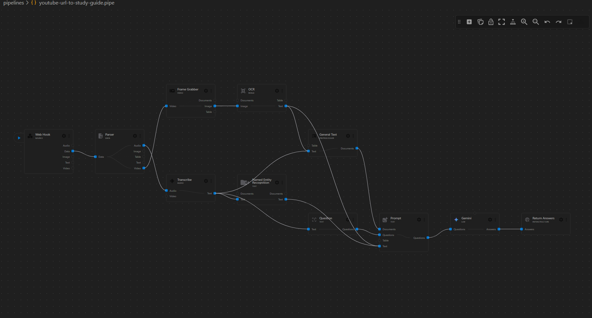
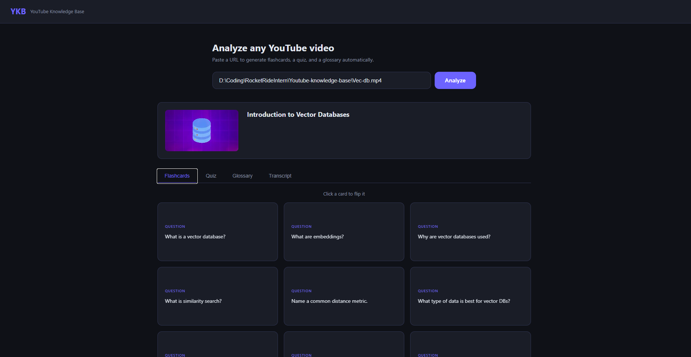
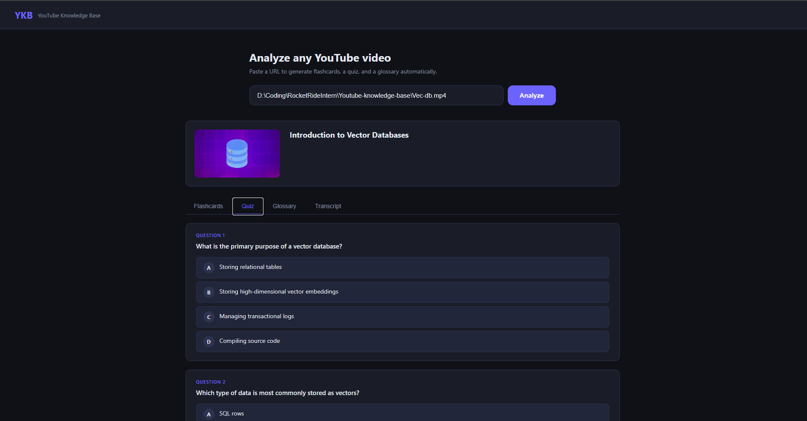
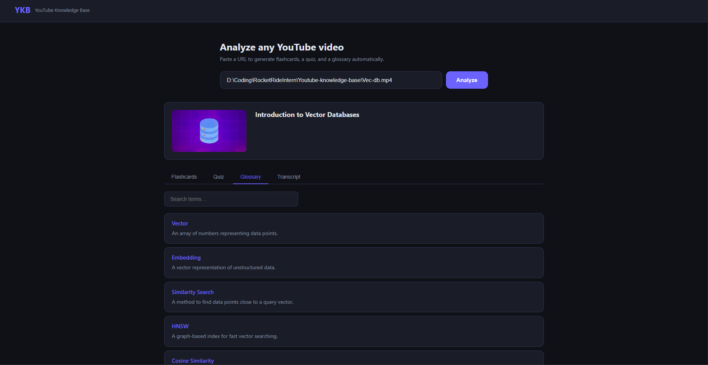

# YouTube Knowledge Base

An intelligent video analysis pipeline that transforms YouTube videos (or local files) into comprehensive study guides using RocketRide and Gemini.

## Features
- **Video Analysis**: Automatically transcribes audio, extracts slide frames, and runs OCR.
- **AI-Powered Insights**: Generates chapters, summaries, key takeaways, and glossary terms.
- **Interactive Learning**: Creates flashcards and quizzes directly from the video content.
- **Metadata Management**: Captures video titles, thumbnails, and duration automatically.

## Tech Stack
- **Backend**: FastAPI, RocketRide (AI Pipeline Engine)
- **AI Models**: Gemini 1.5 Flash / 3.1 Flash Lite
- **Transcription**: Whisper (via RocketRide)
- **Computer Vision**: OpenCV, EasyOCR (via RocketRide)
- **Database**: Qdrant (Vector storage for RAG)

## Setup

1. **Clone the repository**:
   ```bash
   git clone https://github.com/yourusername/youtube-knowledge-base.git
   cd youtube-knowledge-base
   ```

2. **Install dependencies**:
   ```bash
   pip install -r requirements.txt
   ```

3. **Configure environment**:
   Create a `.env` file based on `.env.example`:
   ```bash
   ROCKETRIDE_URI=http://localhost:5565
   ROCKETRIDE_APIKEY=your_rocketride_api_key
   ROCKETRIDE_GEMINI_APIKEY=your_google_ai_key
   ```

4. **Run the application**:
   ```bash
   uvicorn app:app --reload
   ```

## Usage
- Open `http://localhost:8000` in your browser.
- Paste a YouTube URL or a local file path.
- Wait for the analysis to complete.
- Browse the interactive study guide, quiz, and flashcards.

## Pipeline Visualization


## Detailed Architecture
The core logic resides in `pipelines/youtube-url-to-study-guide.pipe`. This multi-modal pipeline leverages RocketRide's distributed processing to handle complex media analysis:

1.  **Ingestion (`webhook`)**: The entry point for video source URLs or binary files.
2.  **Media Parsing (`parse`)**: Parallelizes the workflow by splitting the input into dedicated video and audio streams.
3.  **Visual Processing**:
    *   **Frame Grabbing (`frame_grabber`)**: Detects scene transitions to extract key frames (e.g., slides or diagrams) without redundancy.
    *   **OCR (`ocr`)**: Extracts text from visual frames using EasyOCR and DocTR, ensuring whiteboard notes or slide text are captured.
4.  **Audio Processing**:
    *   **Transcription (`audio_transcribe`)**: High-fidelity speech-to-text using the Whisper `large-v3` model.
    *   **NER (`ner`)**: Identifies key entities like people, organizations, and technologies mentioned in the video.
5.  **Context Synthesis**:
    *   **LangChain Preprocessing**: Chunks both transcript and OCR text to maintain context within LLM token limits.
    *   **Prompt Orchestration**: Aggregates all extracted data into a structured prompt that enforces a specific study-guide JSON schema.
6.  **Intelligence (`llm_gemini`)**: Powered by **Gemini 1.5 Flash**, the system synthesizes chapters, summaries, key points, and interactive learning materials.
7.  **Output (`response_answers`)**: Delivers the finalized JSON study guide to the dashboard.

## User Interface
The dashboard provides an interactive learning experience with three primary modes:

### 1. Flashcards (Initial Page)


### 2. Interactive Quiz


### 3. Glossary & Terms

